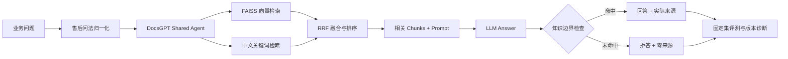

# DocsGPT 企业知识库 RAG 智能客服

> 基于开源 DocsGPT 完成企业售后知识库部署、中文检索优化、知识边界约束与可复跑评测。

本仓库记录的是 DocsGPT 的场景化落地与工程改造，不是自研 RAG 框架，也不是 DocsGPT 源码的二次发布。个人工作集中在部署配置、知识库建设、Agent/Prompt 调试、检索优化、产品界面、故障定位和评测闭环。

## 在线体验

公网域名将在完成 HTTPS、访问口令和部署后补充；仓库不保留裸 IP 或临时服务器入口。

- `/demo`：面向业务用户的售后问答页，只展示问题、回答与实际采用的来源。
- `/ops/`：面向开发和面试诊断的评测台，查看版本对比、固定集指标和单条失败分析。
- `/preview/shared/`：本地静态产品预览，用于验证界面、意图归一化和拒答文案。

推荐问题：

```text
质量问题退货运费谁承担？普通快递最高报销多少？请直接回答并给出来源。
```

边界问题：

```text
海外订单退货运费最高能报销多少？
```

静态预览采用确定性规则与本地知识快照，不调用 DocsGPT API、向量库或 LLM；`/ops/` 中的本地预览记录也不是生产 Trace。公网实例仅用于脱敏、低频的面试演示，不作生产容量或可用性承诺。

## 场景与问题

企业售后知识库不仅要“回答问题”，还需要同时解决以下问题：

- 中文口语问法与知识库书面表达差异较大，单一英文向量模型容易排序错误。
- 检索到正确 Sources，不代表 Prompt 会把文档上下文交给模型，也不代表回答一定采用证据。
- 没有知识依据时必须拒答，并且不能继续展示无关来源卡片。
- FAQ 精简可能提高局部命中率，也可能删掉低频但重要的政策边界。
- 一次成功问答无法证明版本稳定，需要固定问题集、真实回答留档和可复跑评分。

本项目使用电商售后场景构造脱敏知识库，将业务问答页与工程诊断台分离，并围绕“检索相关、回答有据、边界可控、结果可复测”完成迭代。

## 解决方案与系统架构



运行环境包括前端、后端、Worker、PostgreSQL 与 Redis。公网发布使用 Vite 生产构建和 Nginx 静态服务，同源转发 API，并在外层配置 HTTPS、访问口令和限流。

## 个人工作与工程亮点

| 方向 | 完成内容 | 可验证点 |
| --- | --- | --- |
| 部署与运行 | 编排 DocsGPT 前后端、Worker、PostgreSQL、Redis，补充生产构建、Nginx、健康检查和发布配置 | 提供本地启动、冒烟检查、故障排查和受限公网发布脚本 |
| 知识库与 Agent | 构建售后政策、会员、物流、积分与价保知识库，创建共享 Agent 并配置知识边界 Prompt | 正常问题返回答案与依据，知识库未覆盖问题拒答且 Sources 为空 |
| 中文检索优化 | 增加售后口语归一化、FAISS 中文关键词排序，并与向量结果进行 RRF 融合 | 覆盖“有毛病、寄回去的钱谁出、最多给报多少”等真实口语组合问法 |
| 上下文可靠性 | 修复 `extra_source_ids` 遗漏和共享 Agent 初始化竞态，限制进入 Prompt 的低相关 Chunks | 全新浏览器和容器重启后仍能正确加载知识库，不依赖前端缓存 |
| 产品界面 | 将业务问答页与 `/ops/` 诊断台分离，简化共享页并保留回答来源 | 用户界面不混入评测术语，诊断信息仍可独立核查 |
| 评测工程 | 设计 30 条固定用例，编写真实 API 批量运行、断点续跑、离线评分、失败分类与版本对比脚本 | 每条回答、来源、延迟和异常均可留档并重新评分 |

## 关键问题与修复

| 问题 | 定位过程 | 修复结果 |
| --- | --- | --- |
| 页面召回正确 Sources，却回答“未找到相关信息” | 接口检查证明检索成功，进一步发现自定义 Prompt 缺少默认文档上下文变量 | 恢复受证据约束的 Prompt 上下文后，回答能够采用召回片段 |
| 中文售后问题召回排序不稳定 | 目标政策片段一度排在第 6，前 4 个 Chunks 无法覆盖答案 | 增加中文关键词排序与 RRF 融合，并控制进入 Prompt 的片段数量 |
| 全新浏览器或容器重启后出现无知识库请求 | 共享接口遗漏 `extra_source_ids`，初始化时又依赖尚未完成的前端状态 | 提交时直接从 Agent 配置构造 `active_docs`、Prompt 与 chunks |
| 正确拒答仍显示无关 Sources | UI 展示了召回候选，而不是最终答案实际采用的依据 | 边界未命中时清空 Sources；命中时只保留进入答案依据的相关片段 |
| FAQ 精简后出现覆盖缺口和边界泄漏 | 版本对比发现缺少换货、发票政策，并出现拒答后按行业常识补充 | V2 补齐缺失政策，V3 增加统一拒答和禁止外部常识扩写约束 |

## 评测与验证

固定集包含 30 条客服问题：24 条知识命中题与 6 条知识边界题。评分脚本不会调用模型或生成模拟答案，只检查已经采集的真实回答中的必答条件、来源、拒答和无依据扩写。

| 指标 | 原始三文档 | FAQ 精简版 | FAQ-V2 | 边界增强 V3 |
| --- | ---: | ---: | ---: | ---: |
| 回答完整通过率 | 93.3% | 93.3% | 96.7% | 100.0% |
| 必答条件覆盖率 | 95.0% | 96.7% | 100.0% | 100.0% |
| 来源文件命中率 | 100.0% | 100.0% | 100.0% | 100.0% |
| 知识边界拒答率 | 83.3% | 100.0% | 83.3% | 100.0% |
| 端到端通过率 | 93.3% | 93.3% | 96.7% | 100.0% |

四轮均提交了同一批 30/30 条真实回答。2026-07-21 的历史回答使用 1.1 版评分口径重新计算；V2 与 V3 于 2026-08-07 全量运行。这里的 100% 只表示该固定小规模回归集的一次真实运行全部通过，不能外推为生产准确率。完整结果见 [四版本评测报告](evaluation/reports/four-version-comparison-2026-08-07.md)。

2026-09-03 本地代码回归：Node 前端/规则测试 37/37、Python 配置与评测测试 29/29。该结果覆盖静态预览逻辑、口语归一化、拒答零来源、来源一致性、发布端口、访问保护、Worker 配置和结果脱敏，但不等于重新执行了真实向量检索或 LLM 在线评测。

```powershell
# 校验评测集
python scripts/evaluate_rag.py --validate-only

# 使用本地 Agent API 采集真实回答；密钥只从环境变量读取
$env:DOCSGPT_AGENT_API_KEY = "<本地 Agent API Key>"
python scripts/run_docsgpt_evaluation.py --out evaluation/responses/run_2026xxxx.jsonl

# 对真实回答离线评分
python scripts/evaluate_rag.py `
  --responses evaluation/responses/run_2026xxxx.jsonl `
  --out evaluation/reports/run_2026xxxx.md `
  --summary-json evaluation/reports/run_2026xxxx.summary.json

# 前端、规则、部署配置与评测边界回归
node --test deployment/server/frontend/patch_abstain_sources.test.mjs deployment/server/frontend/demo_shell.test.mjs deployment/server/frontend/preview/rag_logic.test.mjs deployment/server/frontend/preview/rag_multidimensional.test.mjs deployment/server/frontend/preview/local_preview.test.mjs
python -m unittest discover -s tests -p "test_*.py"
```

## 本地复现

本仓库不重复分发 DocsGPT 源码。准备好 [DocsGPT 官方仓库](https://github.com/arc53/DocsGPT)及其 `.env` 后运行：

```powershell
.\start-demo.ps1 -DocsGPTPath "E:\codex\DocsGPT"
.\check-demo.ps1 -DocsGPTPath "E:\codex\DocsGPT"
```

检查通过后，可按 [三分钟面试演示手册](DEMO.md) 展示可追溯回答、知识边界拒答和独立评测诊断。完整部署步骤见 [RUNBOOK](RUNBOOK.md)，故障定位见 [TROUBLESHOOTING](TROUBLESHOOTING.md)。

### 受限公网发布

`deployment/server/docker-compose.public.yml` 默认仅将 Nginx 前端绑定到宿主机 `127.0.0.1:5173`，后端 `7091` 只在 Compose 内网可见。服务器外层应使用 [Caddy 示例](deployment/server/Caddyfile.example)或等价反向代理提供 HTTPS。

真实密钥、共享 Agent token、访问口令、数据库数据、原始会话结果和本机覆盖文件均排除在 Git 之外。部署变量模板见 [`deployment/server/.env.example`](deployment/server/.env.example)。

<details>
<summary>仓库内容</summary>

```text
knowledge_base/       脱敏客服知识库
evaluation/           固定集、运行清单与评测报告
scripts/              真实回答采集、断点续跑、评分和对比脚本
tests/                配置、评测边界与部署回归
deployment/server/    公网 Compose、Nginx 外壳与检索补丁
RUNBOOK.md             本地和公网复现步骤
TROUBLESHOOTING.md     故障定位记录
```

</details>

## 项目边界

- 本项目基于开源 DocsGPT，个人贡献是部署、配置、改造、诊断与评测，不宣称自研底层 RAG 框架或训练大模型。
- `/preview/shared/` 是确定性静态预览，不执行真实向量检索或 LLM 调用。
- 历史 30/30 是已保存真实 API 回答的固定集结果，不是实时生产测试，也不是生产准确率。
- 来源文件命中不等于 Chunk 排序正确；Sources 正确也不保证模型采用了证据。
- 公网方案只适用于脱敏、低频面试演示，不承诺生产容量、SLA 或完整租户隔离。
- 知识库为构造的企业客服样例，不包含真实客户数据、订单数据或内部业务资料。

## 开源说明

上游项目：[arc53/DocsGPT](https://github.com/arc53/DocsGPT)。DocsGPT 源码及其许可证以官方仓库为准；本仓库只保存本项目新增的部署配置、知识库样例、补丁、评测脚本、测试和复盘文档。
