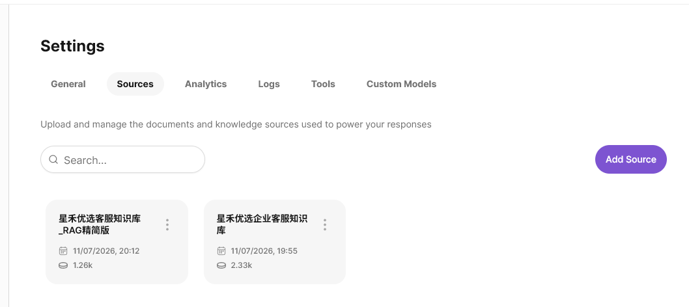
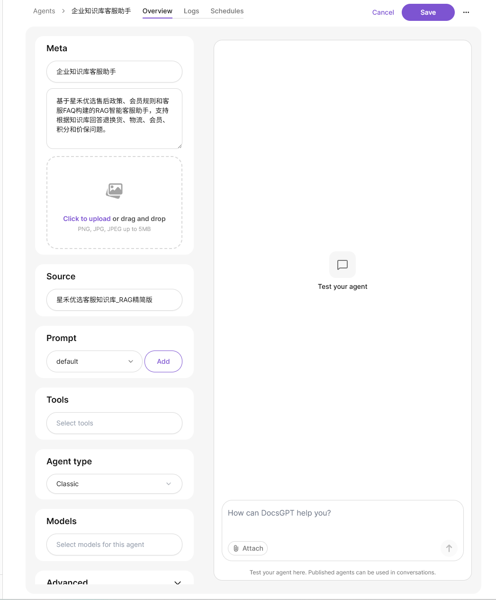
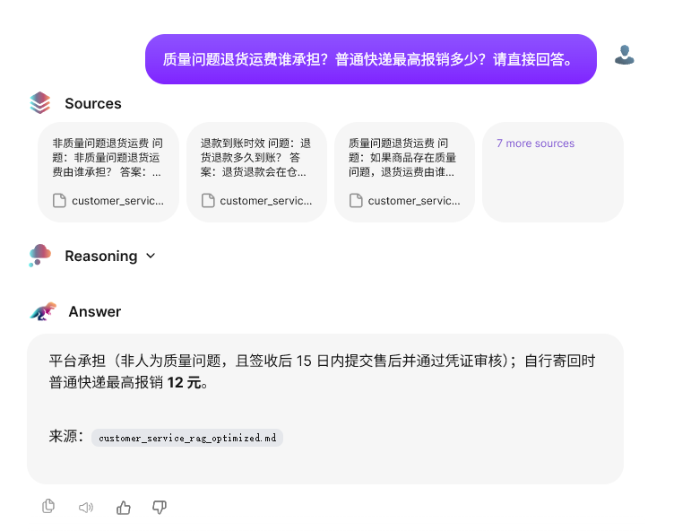

# DocsGPT 企业知识库 RAG 智能客服 Demo

## 项目简介

本项目基于开源项目 [DocsGPT](https://github.com/arc53/DocsGPT) 进行本地部署与场景化配置，构建了一个面向电商售后业务的企业知识库 RAG 智能客服 Demo。系统支持上传业务文档，创建知识库 Source，配置专属 Agent，并基于检索到的文档片段生成可追溯回答。

本仓库不是 DocsGPT 源码的二次发布，而是一次面向实习求职展示的复现与应用实践记录，重点展示从部署、知识库构建、Agent 配置到问答验证的完整闭环。

## 在线演示

- [直接打开企业知识库客服助手 V3](http://124.221.243.125:5173/agents/shared/0676a9387f64b1bb46e1d1a0b24c418db04634f92c47ea6c)
- [查看 RAG 评测与链路诊断台](http://124.221.243.125:5173/ops/)
- 推荐问题：`质量问题退货运费谁承担？普通快递最高报销多少？请直接回答并给出来源。`
- 边界问题：`离我最近的线下维修门店在哪？`

公网实例运行在 2 核 4GB 的面试演示服务器上，使用预置知识库且关闭在线解析 Worker；它用于低频演示，不代表生产容量或可用性承诺。

## Demo 效果

### 1. 知识库 Source 管理



已上传并维护 `星禾优选客服知识库_RAG精简版`，作为 RAG 问答的数据来源。

### 2. Agent 配置



创建 `企业知识库客服助手_V3`，绑定企业客服知识库 Source，并使用知识边界约束 Prompt 与混合召回。

### 3. RAG 问答效果



用户提出售后问题后，系统先召回相关 Sources，再生成带来源依据的回答。

## 核心能力

- 本地部署 DocsGPT，并通过 Docker Compose 启动前端、后端、Worker、PostgreSQL、Redis 等服务。
- 构建企业客服知识库，覆盖售后政策、会员权益、物流规则、积分和价保等场景。
- 创建并发布专属 Agent，将 Agent 与知识库 Source 绑定。
- 验证 RAG 问答链路：用户问题 -> 知识库检索 -> Sources 展示 -> 回答生成。
- 定位并修复一次真实 RAG 问题：检索结果已召回，但自定义 Prompt 未注入文档上下文，导致生成阶段未采纳 Sources。
- 针对英文向量模型在中文售后问题上的错误排序，增加 FAISS 中文关键词排序并与向量检索做 RRF 融合；同时绑定强制知识边界 Prompt，将公网演示召回窗口调为 8 条。
- 修复共享 Agent 接口遗漏 `extra_source_ids` 的兼容问题，确保全新浏览器和容器重启后仍能加载知识库，而不是依赖前端缓存。
- 将公网前端从 Vite 开发服务器改为 Vite 生产构建 + Nginx 静态服务，并为哈希资源设置长期缓存，降低首次加载开销。
- 修复生产构建暴露的共享 Agent 初始化竞态：问答提交时直接从 Agent 配置构造 `active_docs`、Prompt 与 chunks，避免页面刚加载或容器重启后出现无知识库请求。
- 在共享会话完成知识边界拒答后清空低相关 Sources，避免正确拒答仍展示无关来源卡片。
- 设计 30 条固定回归集，覆盖知识命中、来源文件、知识边界拒答与无依据扩写检查。
- 编写真实 API 批量运行、断点续跑、离线评分、失败分类与多版本对比脚本，记录逐条会话、来源、延迟和采集异常。
- 基于失败样本迭代 FAQ、V2 与边界增强 V3；所有指标均来自 DocsGPT 真实回答，不生成模拟答案。
- 新增独立的 RAG 评测与链路诊断台，展示版本回归、固定集指标和单条问题的回答、来源、延迟及规则判定；页面明确区分评测快照与生产实时 Trace。

## 项目结构

```text
.
├── README.md
├── docs/
│   └── DocsGPT_RAG智能客服项目展示_周彦辰.docx
├── knowledge_base/
│   ├── customer_service_after_sales_policy.md
│   ├── customer_service_product_membership.md
│   ├── customer_service_faq.md
│   └── customer_service_rag_optimized.md
├── screenshots/
│   ├── 01_sources.png
│   ├── 02_agent_config.png
│   └── 03_rag_answer.png
├── tests/
│   ├── demo_test_questions.md
│   └── test_evaluation.py
├── evaluation/
│   ├── test_cases.json
│   ├── run_manifest.json
│   └── README.md
├── scripts/
│   ├── evaluate_rag.py
│   ├── compare_rag_runs.py
│   ├── export_docsgpt_evaluation.py
│   └── run_docsgpt_evaluation.py
├── deployment/server/
│   ├── docker-compose.public.yml
│   ├── configure-public-agent.sql
│   ├── check-public-demos.sh
│   ├── frontend/                  # 生产构建、Nginx 与拒答来源清理补丁
│   └── overrides/                 # FAISS 中文关键词混合召回补丁
├── RUNBOOK.md
├── TROUBLESHOOTING.md
└── PROJECT_SUMMARY.md
```

## 知识库说明

`knowledge_base/` 中的文档是为 Demo 构造的企业客服样例知识库，包含：

- 售后政策：退换货规则、质量问题处理、运费承担、退款时效。
- 会员与商品规则：会员权益、积分规则、发货物流、价格保护。
- FAQ：客服高频问答。
- RAG 精简版：将高频问题整理成问答结构；当前版本补齐缺失政策，并增加“不得使用外部常识扩写”的知识边界规则。

## 复现方式

详细步骤见 [RUNBOOK.md](RUNBOOK.md)。

如果本机已经准备好 DocsGPT 官方源码目录和 `.env`，可直接运行：

```powershell
.\start-demo.ps1 -DocsGPTPath "E:\codex\DocsGPT"
```

再执行 `.\check-demo.ps1 -DocsGPTPath "E:\codex\DocsGPT"`；看到 `[PASS]` 后，按 [三分钟面试演示手册](DEMO.md) 展示 V3 Agent 的可追溯回答与知识边界拒答。

简要流程：

1. 安装 Docker Desktop 与 WSL。
2. 克隆 DocsGPT 官方仓库。
3. 使用 Docker Compose 启动 DocsGPT。
4. 在 `Settings > Sources` 中上传知识库文档。
5. 在 `Manage Agents` 中创建 Agent，并绑定知识库 Source。
6. 使用 `tests/demo_test_questions.md` 中的问题进行验证。

## 测试问题示例

```text
质量问题退货运费谁承担？普通快递最高报销多少？请直接回答。
```

预期回答应包含：

- 非人为质量问题，经审核通过后，退货、换货或维修往返运费由平台承担。
- 用户自行寄回时，普通快递最高报销 12 元。
- 不建议到付，需保留快递单号。
- 回答应展示或引用相关 Sources。

## 可复跑评测

仓库提供 `evaluation/test_cases.json`，包含 30 条客服问题：24 条知识命中题与 6 条知识边界题。`scripts/evaluate_rag.py` 不会调用模型，也不会生成模拟答案；它只对真实回答进行关键条件、来源文件、拒答行为和无依据扩写检查。

```powershell
# 校验评测集
python scripts/evaluate_rag.py --validate-only

# 通过本地 Agent API 运行真实评测；密钥只从环境变量读取，不写入文件
$env:DOCSGPT_AGENT_API_KEY = "<本地 Agent API Key>"
python scripts/run_docsgpt_evaluation.py `
  --out evaluation/responses/run_2026xxxx.jsonl

# 对真实回答生成报告
python scripts/evaluate_rag.py `
  --responses evaluation/responses/run_2026xxxx.jsonl `
  --out evaluation/reports/run_2026xxxx.md `
  --summary-json evaluation/reports/run_2026xxxx.summary.json
```

运行脚本为每条问题新建隐藏会话，避免上下文串扰，并在每条完成后立即落盘，支持中断后续跑。完整字段说明与结果解释见 [evaluation/README.md](evaluation/README.md)。

## 四版本真实评测结果

四轮均使用同一 30 条固定用例并提交 30/30 条真实回答。2026-07-21 的历史回答已使用 1.1 版评分口径重新计算；V2 与 V3 于 2026-08-07 全量运行。配置和结果文件见 [`evaluation/run_manifest.json`](evaluation/run_manifest.json) 与 [`evaluation/reports/`](evaluation/reports/)。

| 指标 | 原始三文档 | FAQ 精简版 | FAQ-V2 | 边界增强 V3 |
| --- | ---: | ---: | ---: | ---: |
| 回答完整通过率 | 93.3% | 93.3% | 96.7% | 100.0% |
| 必答条件覆盖率 | 95.0% | 96.7% | 100.0% | 100.0% |
| 来源文件命中率 | 100.0% | 100.0% | 100.0% | 100.0% |
| 知识边界拒答率 | 83.3% | 100.0% | 83.3% | 100.0% |
| 端到端通过率 | 93.3% | 93.3% | 96.7% | 100.0% |

完整四版本对比见 [`four-version-comparison-2026-08-07.md`](evaluation/reports/four-version-comparison-2026-08-07.md)。这里的 100% 仅表示该固定 30 条小规模回归集的一次真实运行全部通过，不能外推为生产准确率。

## 项目复盘

### 1. 检索正确不等于回答正确

最初自定义 Prompt 后，页面能显示正确 Sources，但模型仍提示“知识库中未找到相关信息”。接口测试确认检索层已召回片段，根因是自定义 Prompt 未包含默认模板的文档上下文变量。切回默认 RAG Prompt 后恢复正常。

公网部署后又发现英文向量模型对中文查询排序不稳定：目标政策片段一度排在第 6，前 4 条召回无法覆盖答案。项目为 FAISS 增加中文关键词排序并与向量结果融合，同时扩大这个 12 片段小知识库的最终召回窗口；随后重新验证正确问答、文件来源和知识边界拒答。

### 2. FAQ 精简会引入知识覆盖缺口

FAQ 精简版暴露出“同款缺货处理”和“纸质发票退回”两项政策缺失。V2 补齐后，24 条知识命中题全部通过；但全量回归又发现人工客服服务时间题出现“先拒答、再按行业常识猜测”的边界泄漏。

### 3. 边界规则需要同时约束拒答与扩写

V3 将未知场景、统一拒答模板和“禁止行业常识补充”写入知识库，并新建独立 Source 与 Agent。定向回归通过后再次执行 30 条全量回归，端到端通过率由 96.7% 提升至 100%，知识边界拒答率由 83.3% 提升至 100%。

### 4. 运行与采集也需要监控

V3 的 30 条运行平均延迟为 8.8 秒，P50 为 8.4 秒，P95 为 13.6 秒。V2 运行中还捕获过一次序列化 `thought` 事件混入回答，采集脚本仅剥离格式明确的前缀事件并记录数量，避免把传输异常误判成知识质量问题。
